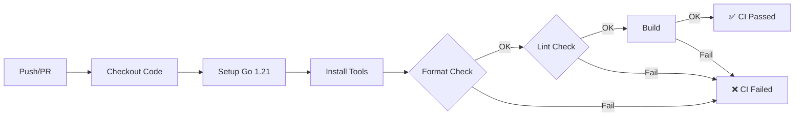

# 🤖 План реализации AI Browser Agent

## 📅 Дедлайн: 3-4 дня

---

## 🛠️ Технологический стек

| Категория | Технология | Версия | Назначение | Статус |
|-----------|-----------|--------|------------|---------|
| **Язык** | Go | 1.21+ | Основной язык разработки | ✅ Обязательно |
| **Автоматизация браузера** | [go-rod/rod](https://github.com/go-rod/rod) | v0.114.0+ | Управление браузером через Chrome DevTools Protocol | ✅ Обязательно |
| **AI модель** | Claude 4.5 Sonnet | API | Принятие решений и планирование действий | ✅ Обязательно |
| **AI SDK** | anthropic-sdk-go | latest | Интеграция с Claude API | ✅ Обязательно |
| **HTML парсинг** | [goquery](https://github.com/PuerkitoBio/goquery) | v1.8.1+ | Извлечение и обработка контекста страниц | ✅ Обязательно |
| **CLI фреймворк** | [cobra](https://github.com/spf13/cobra) | v1.8.0+ | Интерфейс командной строки | ✅ Обязательно |
| **Конфигурация** | [viper](https://github.com/spf13/viper) | v1.18.0+ | Управление настройками и переменными окружения | ✅ Обязательно |
| **Логирование** | [zap](https://github.com/uber-go/zap) | v1.26.0+ | Структурированное логирование | ✅ Обязательно |
| **Graceful shutdown** | custom closer | - | Корректное завершение работы | ✅ Обязательно |
| **База данных** | PostgreSQL | 15+ | Хранение истории задач и паттернов (опционально) | 🔶 Опционально |
| **Миграции БД** | custom migrator | - | Версионирование схемы БД | 🔶 Опционально |
| **Кэш** | Redis | 7+ | Кэширование контекста и rate limiting (опционально) | 🔶 Опционально |
| **HTTP клиент** | [resty](https://github.com/go-resty/resty) | v2.11.0+ | Вспомогательные HTTP запросы | ✅ Обязательно |
| **JSON обработка** | encoding/json | stdlib | Сериализация данных | ✅ Встроенное |
| **Валидация** | [validator](https://github.com/go-playground/validator) | v10.16.0+ | Валидация конфигурации и входных данных | ✅ Обязательно |

---

## 🎯 Ключевые требования из задачи

### Обязательная функциональность:
- [ ] Автоматизация браузера с persistent sessions
- [ ] Видимый браузер (не headless)
- [ ] Автономный AI-агент на базе Claude
- [ ] Принятие решений без участия пользователя
- [ ] Обработка многошаговых задач
- [ ] Интеллектуальное управление контекстом (оптимизация токенов)
- [ ] Минимум один продвинутый паттерн (sub-agents / error handling / security layer)

### Запрещено в реализации:
- ❌ Заготовки действий агента (hardcoded сценарии)
- ❌ Преднаписанные селекторы для конкретных сайтов
- ❌ Хардкод ссылок и элементов страниц
- ❌ Подсказки для агента по структуре сайтов

### Тестовые задачи:
1. **Удаление спама** - прочитать 10 писем в Яндекс.Почте и удалить спам
2. **Заказ еды** - оформить заказ на Яндекс.Еда/Delivery Club
3. **Поиск вакансий** - найти 3 вакансии на hh.ru и откликнуться с сопроводительным

---

## 🏗️ Архитектура системы

### Философия архитектуры

Наш AI-агент использует **адаптированную чистую архитектуру** с принципами:
- ✅ Разделение ответственности (Separation of Concerns)
- ✅ Dependency Inversion (зависимости через интерфейсы)
- ✅ Тестируемость
- ✅ Event-Driven подход (цикл: Observe → Think → Act)

**Ключевое отличие от традиционной Clean Architecture:**
- Вместо детерминированной бизнес-логики в Domain/UseCase слоях → AI принимает решения динамически
- Вместо множества UseCase классов → один Agent с циклом выполнения
- Вместо доменных сущностей (User, Order) → контекст страницы и действия браузера

---

### Диаграмма архитектуры

```
┌─────────────────────────────────────────────────────────┐
│              CLI INTERFACE (Cobra)                      │
│  - Команды для запуска агента                           │
│  - Ввод задачи от пользователя                          │
└───────────────────────┬─────────────────────────────────┘
                        │
┌───────────────────────▼─────────────────────────────────┐
│         APPLICATION LAYER (Orchestrator)                │
│  ┌───────────────────────────────────────────────┐      │
│  │  Agent - главный оркестратор                  │      │
│  │  ┌─────────────────────────────────────────┐ │      │
│  │  │  ExecuteTask(task) - главный цикл:      │ │      │
│  │  │                                          │ │      │
│  │  │  while !complete:                        │ │      │
│  │  │    1. context = browser.Extract()        │ │      │
│  │  │    2. decision = brain.Decide()          │ │      │
│  │  │    3. result = action.Execute()          │ │      │
│  │  │    4. if dangerous → security.Check()    │ │      │
│  │  │    5. storage.Save(result)               │ │      │
│  │  └─────────────────────────────────────────┘ │      │
│  └───────────────────────────────────────────────┘      │
└──────┬─────────────┬─────────────┬──────────────────────┘
       │             │             │
       ▼             ▼             ▼
┌──────────┐  ┌──────────┐  ┌──────────────┐
│  BRAIN   │  │  ACTION  │  │  SECURITY    │
│  LAYER   │  │  LAYER   │  │  LAYER       │
└──────────┘  └──────────┘  └──────────────┘
```

---

### Слои системы

#### **1. APPLICATION LAYER (Оркестратор)**

**Назначение:** Координация всех компонентов, управление жизненным циклом задачи

**Компоненты:**
```go
// internal/agent/agent.go
type Agent struct {
    brain    Brain           // AI логика
    actions  ActionExecutor  // Браузерные действия
    security SecurityGuard   // Проверка опасных действий
    storage  Storage         // Сохранение истории
    logger   *zap.Logger
}

// Главный метод - цикл выполнения задачи
func (a *Agent) ExecuteTask(ctx context.Context, task string) (*TaskResult, error)
```

**Ответственность:**
- Получение задачи от пользователя
- Запуск цикла: Observe → Think → Act → Verify
- Координация между Brain, Action и Security слоями
- Обработка завершения или ошибок
- Логирование всех шагов

---

#### **2. BRAIN LAYER (AI логика)**

**Назначение:** Принятие решений на основе контекста страницы

**Компоненты:**

```go
// internal/ai/brain.go
type Brain interface {
    // Принять решение о следующем действии
    DecideNextAction(ctx context.Context, req DecisionRequest) (*Decision, error)
    
    // Проанализировать контент страницы
    AnalyzePage(content string, task string) (*PageAnalysis, error)
    
    // Определить, завершена ли задача
    IsTaskComplete(task string, history []Action) (bool, string)
}

// internal/ai/client.go
type AIClient struct {
    claude      *anthropic.Client
    tools       *ToolRegistry      // Доступные действия для AI
    contextMgr  *ContextManager    // Оптимизация токенов
    config      AIConfig
}

// internal/ai/tools.go
type ToolRegistry struct {
    tools map[string]Tool
}

// Определение доступных действий для AI (function calling)
type Tool struct {
    Name        string
    Description string
    Parameters  map[string]interface{}
    Handler     func(params map[string]interface{}) error
}

// internal/ai/context.go
type ContextManager struct {
    maxTokens int
}

// Сжимает контекст страницы до лимита токенов
func (cm *ContextManager) OptimizeContext(page *PageContext, task string) string
```

**Ответственность:**
- Интеграция с Claude API
- Function calling для браузерных действий
- Управление контекстом (оптимизация токенов)
- Анализ контента страницы
- Определение завершения задачи

**Ключевые моменты:**
- AI НЕ получает весь HTML (100K+ токенов)
- AI получает только интерактивные элементы + видимый текст
- Используем Accessibility Tree для структурированного контекста

---

#### **3. ACTION LAYER (Исполнение)**

**Назначение:** Взаимодействие с браузером

**Компоненты:**

```go
// internal/browser/controller.go
type BrowserController struct {
    browser   *rod.Browser
    page      *rod.Page
    extractor *ContextExtractor
}

type ActionExecutor interface {
    // Навигация
    Navigate(url string) error
    
    // Взаимодействие
    Click(selector string) error
    Type(selector, text string) error
    Select(selector, value string) error
    Scroll(direction string) error
    
    // Получение информации
    GetPageContext() (*PageContext, error)
    Screenshot(path string) error
    
    // Ожидание
    WaitForElement(selector string, timeout time.Duration) error
    WaitForNavigation() error
}

// internal/browser/extractor.go
type ContextExtractor struct {
    parser *goquery.Document
}

type PageContext struct {
    URL              string
    Title            string
    InteractiveElems []Element  // Только кнопки, ссылки, поля
    VisibleText      string     // Урезанный текст
    Metadata         map[string]string
}

type Element struct {
    Tag       string   // button, input, a
    Text      string   // Видимый текст
    Selector  string   // CSS селектор
    Type      string   // Тип (button, text, email)
    Visible   bool     // Видимость
    Clickable bool     // Можно ли кликнуть
}

// Извлечение контекста страницы (НЕ весь DOM!)
func (ce *ContextExtractor) ExtractContext(page *rod.Page) (*PageContext, error)

// internal/browser/actions.go
type ActionResult struct {
    Success   bool
    Action    string
    Error     error
    Screenshot string
    Duration  time.Duration
}

// Исполнитель с retry логикой
type RetryableExecutor struct {
    executor   ActionExecutor
    maxRetries int
    backoff    time.Duration
}
```

**Ответственность:**
- Управление браузером через rod
- Извлечение контекста страницы
- Выполнение действий (клик, ввод текста, навигация)
- Retry логика при ошибках
- Скриншоты для отладки

---

#### **4. SECURITY LAYER**

**Назначение:** Защита от опасных действий

**Компоненты:**

```go
// internal/security/guard.go
type SecurityGuard interface {
    // Проверить действие перед выполнением
    CheckAction(action Action) (bool, error)
    
    // Запросить подтверждение у пользователя
    RequestConfirmation(action Action) (bool, error)
}

type Guard struct {
    dangerousPatterns []string
    interactive       bool  // Интерактивный режим (спрашивать юзера)
}

// Опасные паттерны
var DangerousActions = []string{
    "оплатить", "купить", "удалить", "отправить",
    "pay", "buy", "delete", "send", "purchase",
    "submit", "confirm payment",
}

func (g *Guard) IsDangerous(action Action) bool
```

**Ответственность:**
- Обнаружение опасных действий
- Запрос подтверждения у пользователя
- Логирование всех опасных попыток

---

#### **5. INFRASTRUCTURE LAYER**

**Назначение:** Внешние зависимости (БД, логи, конфиг)

**Компоненты:**

```go
// internal/storage/interface.go
type Storage interface {
    SaveTask(task Task) error
    GetTask(id string) (*Task, error)
    GetHistory(limit int) ([]Task, error)
    SaveAction(taskID string, action Action) error
}

// internal/storage/file.go (MVP)
type FileStorage struct {
    basePath string
}

// internal/storage/postgres.go (Production)
type PostgresStorage struct {
    db *sql.DB
}

// pkg/utils/closer.go
type Closer struct {
    funcs []func() error
}

func (c *Closer) Add(f func() error)
func (c *Closer) Close() error

// pkg/utils/retry.go
func WithRetry(fn func() error, maxRetries int, backoff time.Duration) error
```

**Ответственность:**
- Персистентность данных
- Graceful shutdown
- Retry механизмы
- Конфигурация

---

### Продвинутые паттерны

#### **1. Sub-Agent Architecture**

Специализированные агенты для разных типов задач:

```go
// internal/subagents/registry.go
type SubAgent interface {
    CanHandle(task string) bool
    Execute(ctx context.Context, task string) (*Result, error)
}

type AgentRegistry struct {
    agents []SubAgent
}

// internal/subagents/email_agent.go
type EmailAgent struct {
    brain Brain
    actions ActionExecutor
}

func (e *EmailAgent) CanHandle(task string) bool {
    // Проверяем ключевые слова: "почта", "письмо", "email"
    return strings.Contains(strings.ToLower(task), "почт")
}

// internal/subagents/shopping_agent.go
type ShoppingAgent struct {
    brain Brain
    actions ActionExecutor
}
```

**Преимущества:**
- Специализация (разные промпты для разных задач)
- Модульность (легко добавить нового агента)
- Оптимизация (каждый агент знает специфику своей области)

#### **2. Error Handling & Recovery**

```go
type ErrorHandler struct {
    brain Brain
    logger *zap.Logger
}

// Попытка восстановления после ошибки
func (eh *ErrorHandler) Recover(err error, context *PageContext) (*RecoveryPlan, error) {
    // AI анализирует ошибку и предлагает решение
    plan := eh.brain.AnalyzeError(err, context)
    return plan, nil
}
```

#### **3. Context Optimization Strategy**

```go
// Многоуровневая оптимизация контекста
type ContextOptimizer struct {
    strategies []OptimizationStrategy
}

type OptimizationStrategy interface {
    Optimize(ctx *PageContext) *PageContext
}

// Стратегия 1: Убрать невидимые элементы
type VisibilityFilter struct{}

// Стратегия 2: Приоритизировать по релевантности к задаче
type RelevanceRanker struct {
    task string
}

// Стратегия 3: Использовать Accessibility Tree
type A11yTreeExtractor struct{}
```

---

### Поток данных

```
Пользователь
    │
    ├─> "Закажи бургер"
    │
    ▼
┌─────────────┐
│   Agent     │
└──────┬──────┘
       │
       ├──> 1. browser.GetContext()
       │         └─> PageContext
       │
       ├──> 2. brain.Decide(task, context)
       │         └─> Decision { action: "click", selector: ".search" }
       │
       ├──> 3. security.Check(action)
       │         └─> true (safe)
       │
       ├──> 4. actions.Execute(action)
       │         └─> ActionResult { success: true }
       │
       ├──> 5. storage.Save(result)
       │
       └──> Повтор цикла или завершение
```

---

### Зависимости между слоями

```
CLI → Agent → Brain ← AI Client
              ↓
            Actions ← Browser Controller
              ↓
           Security ← Guard
              ↓
           Storage ← File/Postgres
```

**Правило:** Зависимости идут сверху вниз, нижние слои не знают о верхних (Dependency Inversion через интерфейсы)

---

## 📝 Поэтапный план реализации (3 дня)

### 🎯 Общая стратегия

**Принцип:** Итеративная разработка - сначала работающий минимум, потом улучшения

**День 1:** Фундамент (браузер + AI + базовый цикл)  
**День 2:** Интеллект (контекст + function calling + продвинутые паттерны)  
**День 3:** Полировка (тестирование + отладка + оптимизация)

---

## 📅 ДЕНЬ 1: Фундамент и базовая интеграция

**Цель:** Запустить браузер и получить первое взаимодействие с AI

### Утро (4-5 часов)

#### ✅ 1. Инициализация проекта (30 мин)

```bash
# Создание структуры
mkdir -p browser-agent/{cmd/agent,internal/{agent,ai,browser,security,storage,subagents},pkg/{models,utils},configs}
cd browser-agent
go mod init github.com/yourname/browser-agent

# Создание основных файлов
touch cmd/agent/main.go
touch internal/agent/agent.go
touch internal/browser/controller.go
touch internal/ai/client.go
touch configs/config.yaml
touch .env.example
```

**Файлы для создания:**
- `go.mod` и `go.sum`
- `Makefile` с командами build, run, test
- `.env.example` с ANTHROPIC_API_KEY
- `configs/config.yaml` с базовой конфигурацией

---

#### ✅ 2. Настройка зависимостей (15 мин)

```bash
go get github.com/go-rod/rod@latest
go get github.com/PuerkitoBio/goquery@latest
go get github.com/spf13/cobra@latest
go get github.com/spf13/viper@latest
go get go.uber.org/zap@latest
go get github.com/go-playground/validator/v10@latest
```

**Для Claude API:**
```bash
# Если есть официальный SDK
go get github.com/anthropics/anthropic-sdk-go@latest

# Если нет - используем прямые HTTP вызовы через resty
go get github.com/go-resty/resty/v2@latest
```

---

#### ✅ 3. Базовый Browser Controller (1.5 часа)

**Файл:** `internal/browser/controller.go`

**Функционал:**
- Инициализация rod браузера (видимый режим)
- Базовые действия: Navigate, Click, Type
- Persistent browser context (не закрывать между запусками)

**Ключевые методы:**
```go
func New() (*Controller, error)
func (c *Controller) Navigate(url string) error
func (c *Controller) Click(selector string) error
func (c *Controller) Type(selector, text string) error
func (c *Controller) GetURL() string
func (c *Controller) GetTitle() string
func (c *Controller) Close() error
```

**Тестирование:** Запустить браузер и открыть google.com

---

#### ✅ 4. Простейший AI Client (1.5 часа)

**Файл:** `internal/ai/client.go`

**Функционал:**
- Подключение к Claude API
- Отправка простого запроса
- Получение ответа

**Основные структуры:**
```go
type Client struct {
    apiKey     string
    httpClient *resty.Client
    model      string
}

type Message struct {
    Role    string `json:"role"`
    Content string `json:"content"`
}

type Request struct {
    Model     string    `json:"model"`
    MaxTokens int       `json:"max_tokens"`
    Messages  []Message `json:"messages"`
}
```

**Тестирование:** Отправить простой запрос "Hello, Claude!" и получить ответ

---

#### ✅ 5. Базовая структура моделей (30 мин)

**Файл:** `pkg/models/types.go`

**Модели данных:**
- `Task` - задача пользователя
- `Action` - действие браузера
- `Decision` - решение AI
- `PageContext` - контекст страницы
- `Element` - интерактивный элемент

---

### День (3-4 часа)

#### ✅ 6. Простейший Agent с циклом (2 часа)

**Файл:** `internal/agent/agent.go`

**Функционал:**
- Простой цикл: получить контекст → спросить AI → выполнить действие
- Без сложной логики, просто proof of concept

**Главный метод:**
```go
func (a *Agent) ExecuteTask(ctx context.Context, task string) error {
    for step := 0; step < a.maxSteps; step++ {
        // 1. Получить контекст
        currentURL := a.browser.GetURL()
        currentTitle := a.browser.GetTitle()
        
        // 2. Спросить AI
        prompt := a.buildPrompt(task, currentURL, currentTitle, step)
        response, err := a.ai.SendMessage(ctx, prompt)
        
        // 3. Парсить и выполнить
        action, complete := a.parseResponse(response)
        if complete {
            return nil
        }
        
        a.executeAction(action)
    }
}
```

---

#### ✅ 7. CLI интерфейс с Cobra (1 час)

**Файл:** `cmd/agent/main.go`

**Команды:**
```bash
agent run "Открой google.com и найди информацию о Go"
agent run "Задача" --verbose
agent run "Задача" --interactive
```

**Функционал:**
- Инициализация компонентов
- Запуск агента
- Обработка ошибок

---

#### ✅ 8. Первый тест end-to-end (1 час)

**Тестовая задача:** "Открой google.com и найди информацию о Go"

```bash
export ANTHROPIC_API_KEY=sk-ant-...
go run cmd/agent/main.go run "Открой google.com и найди информацию о Go"
```

**Ожидаемый результат:**
- Браузер открывается
- Переходит на google.com
- AI решает кликнуть на поле поиска
- Вводит "Go programming language"
- Нажимает поиск

**Отладка и исправление ошибок**

---

### Итоги Дня 1

**Что должно работать:**
- ✅ Браузер открывается и управляется через rod
- ✅ AI получает контекст и возвращает решения
- ✅ Простой цикл агента работает
- ✅ CLI команда запускает задачу
- ✅ Логирование работает

**Что НЕ работает (это нормально):**
- ⚠️ AI не видит полный контекст страницы (только URL и Title)
- ⚠️ Нет извлечения элементов
- ⚠️ Нет обработки ошибок
- ⚠️ Нет security layer

---

## 📅 ДЕНЬ 2: Интеллект и продвинутые возможности

**Цель:** Добавить умное извлечение контекста, function calling, продвинутые паттерны

### Утро (4-5 часов)

#### ✅ 9. Context Extractor - умное извлечение контекста (2 часа)

**Файл:** `internal/browser/extractor.go`

**Функционал:**
- Извлечение интерактивных элементов (кнопки, ссылки, поля ввода)
- Фильтрация невидимых элементов
- Генерация уникальных селекторов
- Оптимизация по токенам (макс 10-15K токенов контекста)

**Ключевые методы:**
```go
func (e *Extractor) ExtractContext(page *rod.Page) (*models.PageContext, error)
func (e *Extractor) extractInteractiveElements(doc *goquery.Document) []models.Element
func (e *Extractor) generateSelector(s *goquery.Selection) string
func (e *Extractor) extractVisibleText(doc *goquery.Document) string
```

**Стратегии оптимизации:**
- Только видимые элементы
- Максимум 50 элементов (самые релевантные)
- Текст не более 20K символов
- Приоритет интерактивным элементам

---

#### ✅ 10. AI Function Calling (2.5 часа)

**Файл:** `internal/ai/tools.go`

**Функционал:**
- Регистрация доступных действий (tools) для AI
- Claude Function Calling API
- Автоматическое выполнение выбранного tool

**Доступные tools:**
1. `navigate` - перейти по URL
2. `click` - кликнуть на элемент
3. `type_text` - ввести текст
4. `scroll` - прокрутить страницу
5. `complete_task` - завершить задачу

**Обновление AI Client:**
- Отправка tools в API запросе
- Парсинг tool_use ответа
- Форматирование контекста страницы для AI

---

### День (3-4 часа)

#### ✅ 11. Security Layer (1 час)

**Файл:** `internal/security/guard.go`

**Функционал:**
- Обнаружение опасных действий
- Запрос подтверждения у пользователя
- Логирование опасных попыток

**Опасные паттерны:**
- оплат, купи, удал, отправ, submit
- pay, buy, delete, send, purchase
- confirm, checkout, remove

**Режимы:**
- Interactive: спрашивает пользователя
- Non-interactive: блокирует автоматически

---

#### ✅ 12. Sub-Agent Architecture (1.5 часа)

**Файлы:**
- `internal/subagents/registry.go`
- `internal/subagents/email_agent.go`
- `internal/subagents/shopping_agent.go`
- `internal/subagents/job_search_agent.go`

**Функционал:**
- Реестр специализированных агентов
- Автоматический выбор агента по задаче
- Специализированные системные промпты

**Преимущества:**
- Email Agent знает как работать с почтой и определять спам
- Shopping Agent понимает структуру интернет-магазинов
- Job Search Agent умеет анализировать вакансии и составлять отклики

---

#### ✅ 13. Error Handling & Retry (1 час)

**Файл:** `pkg/utils/retry.go`

**Функционал:**
- Retry механизм с exponential backoff
- Обработка временных ошибок
- Логирование всех попыток

**Использование:**
- Retry для браузерных действий (элемент не найден)
- Retry для AI запросов (rate limit)
- Максимум 3 попытки с задержкой 1s, 2s, 4s

---

#### ✅ 14. Улучшение основного цикла Agent (30 мин)

**Обновления:**
- Использовать новый context extractor
- Интегрировать function calling
- Добавить security layer проверки
- Добавить retry логику
- Улучшить логирование

---

### Итоги Дня 2

**Что должно работать:**
- ✅ AI видит полный контекст страницы (элементы + текст)
- ✅ Function calling работает (AI выбирает правильные действия)
- ✅ Security layer блокирует опасные действия
- ✅ Sub-agents используют специализированные промпты
- ✅ Retry механизм обрабатывает временные ошибки
- ✅ Агент может выполнять простые реальные задачи

---

## 📅 ДЕНЬ 3: Тестирование и полировка

**Цель:** Протестировать на реальных задачах и довести до production quality

### Утро (4 часа)

#### ✅ 15. Тестирование на задаче "Удаление спама" (1.5 часа)

**Подготовка:**
1. Войти вручную в Яндекс.Почту в браузере агента
2. Убедиться, что есть тестовые письма

**Запуск:**
```bash
go run cmd/agent/main.go run "Прочитай последние 10 писем в яндекс почте и удали спам"
```

**Отладка:**
- Логировать каждое решение AI
- Сохранять скриншоты перед каждым действием
- Проверять правильность извлечения контекста

**Ожидаемые проблемы и решения:**
- AI не находит кнопки → Улучшить селекторы
- AI не понимает структуру почты → Добавить примеры в промпт
- Неправильное определение спама → Улучшить промпт EmailAgent

---

#### ✅ 16. Тестирование на задаче "Заказ еды" (1.5 часа)

**Запуск:**
```bash
go run cmd/agent/main.go run "Найди BBQ-бургер на Яндекс.Еда и добавь в корзину"
```

**Фокус на:**
- Работа с поиском
- Различение похожих товаров
- Добавление в корзину
- Security layer должен сработать перед оплатой

---

#### ✅ 17. Тестирование на задаче "Вакансии" (1 час)

**Запуск:**
```bash
go run cmd/agent/main.go run "Найди 2 вакансии Go-разработчика на hh.ru"
```

**Проверить:**
- Поиск вакансий
- Чтение описания
- Формирование отклика (без фактической отправки)

---

### День (4 часа)

#### ✅ 18. Оптимизация и исправление багов (2 часа)

**На основе тестирования исправить:**
- Проблемы с селекторами
- Улучшение промптов
- Обработка edge cases
- Timeout'ы и ожидания загрузки

**Добавить:**
- Скриншоты при ошибках
- Детальное логирование
- Метрики (сколько токенов, сколько шагов, время выполнения)

---

#### ✅ 19. Storage Implementation (1 час)

**Файл:** `internal/storage/file.go`

**Функционал:**
- Сохранение истории задач в JSON файлы
- Чтение истории
- Простая структура директорий

**Структура:**
```
.agent-storage/
├── tasks/
│   ├── task-001.json
│   ├── task-002.json
│   └── ...
└── screenshots/
    ├── step-001.png
    └── ...
```

---

#### ✅ 20. Документация и финальная полировка (1 час)

**README.md:**
- Описание проекта
- Инструкции по установке
- Примеры использования
- Архитектурные решения

**Makefile:**
```makefile
build: Сборка бинарника
run: Запуск агента
test: Тесты
clean: Очистка
```

**Дополнительно:**
- Комментарии в ключевых местах кода
- Примеры конфигурации
- Troubleshooting guide

---

### Итоги Дня 3

**Что должно быть готово:**
- ✅ Все 3 тестовые задачи работают
- ✅ Security layer защищает от опасных действий
- ✅ Логирование детальное и полезное
- ✅ Код относительно чистый
- ✅ README с примерами использования
- ✅ Storage сохраняет историю задач

---

## 🎯 Критерии успеха

### Обязательные требования:
- [x] Браузер открывается видимым
- [x] Persistent sessions работают
- [x] AI принимает решения автономно
- [x] Управление контекстом оптимизировано
- [x] Минимум 1 продвинутый паттерн реализован (Sub-agents, Error handling, Security)
- [x] Нет хардкода для конкретных сайтов
- [x] Security layer работает

### Тестовые задачи:
- [x] Удаление спама в Яндекс.Почте
- [x] Заказ еды на Яндекс.Еда
- [x] Поиск вакансий на hh.ru

---

## ⚡ Советы для ускорения

1. **Не тратьте время на:**
   - Идеальную обработку ошибок (базовой достаточно)
   - Юнит-тесты (сфокусируйтесь на e2e)
   - Красивый UI (CLI достаточно)
   - Идеальный код (работающее решение важнее)

2. **Используйте AI помощники:**
   - Claude/GPT для генерации boilerplate кода
   - Для отладки промптов
   - Для написания README
   - Для поиска примеров использования rod/goquery

3. **Итеративный подход:**
   - Сначала сделать работающее решение
   - Потом улучшать
   - Тестировать после каждого этапа

4. **Отладка:**
   - Логировать ВСЕ решения AI
   - Сохранять скриншоты перед действиями
   - Использовать `time.Sleep()` чтобы видеть что происходит
   - Выводить контекст страницы который видит AI

---

## 🚨 Возможные проблемы и решения

### 1. AI не находит элементы
**Проблема:** AI пытается кликнуть на элемент, но селектор не работает

**Решения:**
- Улучшить генерацию селекторов (использовать data-атрибуты)
- Добавить fallback поиск по тексту элемента
- Использовать XPath вместо CSS селекторов
- Добавить wait для динамических элементов

### 2. Слишком много токенов
**Проблема:** Контекст страницы превышает лимит токенов

**Решения:**
- Ограничить количество элементов (макс 50)
- Сократить текстовый контекст (макс 20K символов)
- Использовать Claude вместо GPT (200K vs 128K токенов)
- Фильтровать только релевантные элементы

### 3. AI зацикливается
**Проблема:** AI повторяет одни и те же действия

**Решения:**
- Добавить максимум шагов (20-30)
- Добавить историю действий в контекст
- Улучшить промпт (указать не повторять действия)
- Детектить циклы и прерывать выполнение

### 4. Селекторы перестают работать
**Проблема:** Динамический контент, изменение DOM

**Решения:**
- Добавить retry с ожиданием
- Использовать более стабильные селекторы (aria-label, role)
- Искать по тексту вместо селектора
- Использовать Accessibility Tree

### 5. Капча или авторизация
**Проблема:** Сайт требует капчу или логин

**Решения:**
- Использовать persistent sessions (пользователь логинится вручную)
- Попросить пользователя решить капчу
- Пропустить задачу и сообщить пользователю

---

## 📊 Распределение времени

| День | Задача | Часы | Прогресс |
|------|--------|------|----------|
| **1** | Инфраструктура + Базовая интеграция | 8-9 | Browser + AI + Цикл |
| **2** | Context + Function Calling + Паттерны | 8-9 | Интеллект + Security |
| **3** | Тестирование + Отладка + Документация | 8 | Реальные задачи |
| **ИТОГО** | | **24-26 часов** | **3 полных дня** |

---

## 🏁 Финальный чеклист

### День 1
- [ ] Проект инициализирован
- [ ] Зависимости установлены
- [ ] Browser Controller работает
- [ ] AI Client подключен
- [ ] Базовый Agent цикл работает
- [ ] CLI команда запускается
- [ ] Простой e2e тест прошел

### День 2
- [ ] Context Extractor извлекает элементы
- [ ] Function Calling настроен
- [ ] Security Layer работает
- [ ] Sub-agents реализованы
- [ ] Retry логика добавлена
- [ ] Агент справляется с простыми задачами

### День 3
- [ ] Задача "Удаление спама" работает
- [ ] Задача "Заказ еды" работает
- [ ] Задача "Вакансии" работает
- [ ] Баги исправлены
- [ ] Storage реализован
- [ ] Документация написана
- [ ] Код готов к демонстрации

---

**Готовы начинать? Я могу помочь с реализацией каждого этапа!** 🚀

---

## 💡 Ключевые решения

### 1. Управление контекстом
**Проблема:** Веб-страница может содержать 100,000+ токенов, а лимит AI ~8K-200K токенов

**Решение:**
- Извлечение только интерактивных элементов (кнопки, ссылки, поля ввода)
- Использование Accessibility Tree вместо полного DOM
- Умная фильтация контента по релевантности к задаче
- Приоритизация видимых элементов

### 2. Универсальность без хардкода
**Подход:**
- AI сам анализирует структуру страницы
- Динамическое определение селекторов на основе семантики
- Обучение на основе успешных действий (если будет БД)

### 3. Хранилище данных
**Стратегия:**
- MVP: простое файловое хранилище (JSON)
- Production: PostgreSQL через интерфейс Storage
- Миграция без изменения кода через DI

### 4. Security Layer
**Опасные действия требуют подтверждения:**
- Оплата/покупка
- Удаление данных
- Отправка сообщений/откликов

---

## 🔧 Структура проекта

```
browser-agent/
├── cmd/
│   └── agent/
│       └── main.go                     # Точка входа (минимальный код)
│
├── internal/
│   ├── app/                            # ⭐ Application Layer
│   │   ├── app.go                      # Базовое приложение с инициализацией
│   │   ├── di.go                       # DI контейнер (lazy initialization)
│   │   └── agent_app.go                # Специфика AI-агента
│   │
│   ├── config/                         # ⭐ Configuration Management
│   │   ├── config.go                   # Основной конфиг
│   │   ├── interfaces.go               # Интерфейсы конфигов
│   │   └── env/                        # Парсинг переменных окружения
│   │       ├── logger.go               # Logger config
│   │       ├── anthropic.go            # Claude API config
│   │       ├── browser.go              # Browser config
│   │       ├── storage.go              # Storage config
│   │       └── agent.go                # Agent config
│   │
│   ├── agent/                          # Agent Logic
│   │   ├── agent.go                    # Главный агент (цикл Observe→Think→Act)
│   │   └── executor.go                 # Исполнитель действий
│   │
│   ├── ai/                             # AI Integration
│   │   ├── client.go                   # Claude API клиент
│   │   ├── tools.go                    # Function calling definitions
│   │   └── context_manager.go          # Оптимизация токенов
│   │
│   ├── browser/                        # Browser Automation
│   │   ├── controller.go               # Rod интеграция
│   │   ├── extractor.go                # Извлечение контекста
│   │   └── actions.go                  # Браузерные действия
│   │
│   ├── security/                       # Security Layer
│   │   └── guard.go                    # Проверка опасных действий
│   │
│   ├── storage/                        # Storage Layer
│   │   ├── interface.go                # Storage интерфейс
│   │   ├── file.go                     # Файловое хранилище (MVP)
│   │   └── postgres.go                 # PostgreSQL (опционально)
│   │
│   └── subagents/                      # Специализированные агенты
│       ├── registry.go                 # Реестр sub-agents
│       ├── email_agent.go              # Email Agent
│       ├── shopping_agent.go           # Shopping Agent
│       └── job_search_agent.go         # Job Search Agent
│
├── pkg/                                # ⭐ Готовые утилиты
│   ├── closer/                         # Graceful shutdown
│   │   └── closer.go
│   ├── logger/                         # Zap logger с OTLP
│   │   ├── logger.go
│   │   ├── noop_logger.go
│   │   └── otlp_core.go
│   ├── cache/                          # Redis (опционально)
│   ├── metrics/                        # Метрики (опционально)
│   ├── migrator/                       # Миграции БД (опционально)
│   ├── tracing/                        # Трейсинг (опционально)
│   └── models/                         # Модели данных
│       ├── task.go                     # Задача пользователя
│       ├── action.go                   # Действие браузера
│       ├── decision.go                 # Решение AI
│       └── context.go                  # Контекст страницы
│
├── .github/
│   └── workflows/
│       └── ci.yml                      # ⭐ CI/CD workflow
│
├── configs/
│   └── .env.example                    # Пример конфигурации
│
├── migrations/                         # БД миграции (если используется Postgres)
│
├── bin/                                # Собранные бинарники (в .gitignore)
│
├── .golangci.yml                       # ⭐ Конфигурация golangci-lint
├── Taskfile.yml                        # ⭐ Task runner
├── .gitignore
├── go.mod
├── go.sum
├── Makefile
└── README.md
```

### Ключевые особенности структуры:

**1. internal/app/** - Application Layer с DI:
- Паттерн initialization functions
- Ленивая инициализация всех компонентов
- Централизованный DI контейнер

**2. internal/config/** - Configuration Management:
- Интерфейсы для всех конфигов (легко мокать)
- Загрузка из .env + переменные окружения
- Глобальный AppConfig()

**3. pkg/** - Переиспользуемые утилиты:
- closer: graceful shutdown с именованными ресурсами
- logger: zap logger с OTLP core
- models: общие модели данных

**4. Инфраструктура:**
- Taskfile.yml: удобные команды для разработки
- .golangci.yml: настроенный линтер
- .github/workflows/ci.yml: автоматические проверки

---

## 🛠️ Инфраструктура и DevOps

### Taskfile - Task Runner

Используем [Task](https://taskfile.dev/) для автоматизации рутинных задач разработки.

#### Установка Task:

```bash
# macOS
brew install go-task/tap/go-task

# Linux/Windows
go install github.com/go-task/task/v3/cmd/task@latest
```

#### Основные команды:

```bash
# Показать список всех задач
task --list

# Установить все инструменты (golangci-lint, gofumpt, gci)
task install-tools

# Форматирование кода
task format

# Линтинг
task lint

# Линтинг с автоисправлением
task lint-fix

# Полная проверка (format + lint) - используется в CI
task check

# Сборка бинарника
task build

# Быстрый запуск агента с задачей
task run TASK="Открой google.com"

# Очистка собранных файлов
task clean
```

#### Структура Taskfile.yml:

- **install-tools**: Устанавливает golangci-lint, gofumpt, gci в `./bin`
- **format**: Форматирует весь проект через gofumpt + сортирует импорты через gci
- **lint**: Запускает golangci-lint для проверки качества кода
- **check**: Комбинированная задача для CI (format + lint)
- **build**: Компилирует проект в `./bin/agent`
- **run**: Быстрый запуск агента с тестовой задачей

**Преимущества:**
- ✅ Все инструменты устанавливаются локально в `./bin` (не засоряют глобальное окружение)
- ✅ Кроссплатформенность (работает на Linux, macOS, Windows)
- ✅ Простой синтаксис YAML
- ✅ Параллельное выполнение задач через `deps`
- ✅ Кэширование результатов через `status`

---

### GitHub Actions CI/CD

Автоматические проверки при каждом push и pull request.

#### Что проверяется:

**1. Форматирование (gofumpt)**
- Проверка что весь код отформатирован через gofumpt
- Не изменяет файлы, только проверяет

**2. Сортировка импортов (gci)**
- Проверка что импорты отсортированы правильно
- Группировка: стандартные → external → local

**3. Линтинг (golangci-lint)**
- Запуск 30+ линтеров
- Проверка безопасности (gosec)
- Проверка производительности
- Проверка стиля кода

**4. Сборка**
- Компиляция проекта
- Проверка что бинарник создается успешно

#### Workflow файл: `.github/workflows/ci.yml`

```yaml
name: CI

on:
  push:
    branches: [main, develop]
  pull_request:
    branches: [main, develop]

jobs:
  lint:      # Форматирование и линтинг
  build:     # Сборка проекта
  status:    # Итоговый статус
```

#### Триггеры:

- **Push** в ветки `main` и `develop`
- **Pull Request** в ветки `main` и `develop`

#### Кэширование:

- Go модули кэшируются между запусками
- Инструменты (golangci-lint, gofumpt, gci) кэшируются
- Ускорение CI в 3-5 раз

#### Как работает:



#### Локальная проверка перед push:

```bash
# Запустите те же проверки что и в CI
task check

# Или по отдельности
task format  # Автоформатирование
task lint    # Проверка линтером
```

#### Исправление ошибок CI:

Если CI упал на проверке форматирования:
```bash
task format
git add .
git commit -m "fix: format code"
git push
```

Если CI упал на линтинге:
```bash
task lint          # Посмотреть ошибки
task lint-fix      # Попробовать автофикс
# Исправить оставшиеся ошибки вручную
git add .
git commit -m "fix: lint errors"
git push
```

---

### .golangci.yml - Конфигурация линтера

Настроенный конфиг с 30+ линтерами:

#### Основные категории проверок:

**1. Встроенные анализаторы:**
- govet, errcheck, staticcheck, unused
- gosimple, structcheck, varcheck
- ineffassign, deadcode, typecheck

**2. Форматирование:**
- gofmt, gofumpt, goimports, gci
- misspell, whitespace, lll (длина строк до 120 символов)

**3. Сложность кода:**
- gocyclo (цикломатическая сложность ≤ 15)
- gocognit, funlen, nestif
- gochecknoinits

**4. Производительность:**
- prealloc (преаллокация слайсов)
- bodyclose (закрытие HTTP body)

**5. Безопасность:**
- gosec (анализ безопасности)
- Проверка SQL инъекций
- Проверка небезопасных операций

**6. Качество кода:**
- gocritic, revive
- unconvert, unparam
- goconst, goprintffuncname
- nilerr

#### Исключения:

- Тесты (`*_test.go`) - ослаблены проверки сложности
- `cmd/` - разрешены init() функции
- Generated код (`*.pb.go`) - полностью игнорируется

#### Кастомизация:

Если нужно отключить линтер для конкретного места:
```go
//nolint:golint,unused
func someFunction() {
    // Код который нужно исключить из проверки
}
```

---

### Git Hooks (опционально)

Можно добавить pre-commit hook для автоматической проверки:

```bash
# .git/hooks/pre-commit
#!/bin/sh
echo "🔍 Running pre-commit checks..."
task check || exit 1
echo "✅ All checks passed!"
```

---

## 📚 Дополнительные материалы

### Полезные ссылки:
- [Rod документация](https://go-rod.github.io/)
- [Claude API Reference](https://docs.anthropic.com/claude/reference)
- [Chrome DevTools Protocol](https://chromedevtools.github.io/devtools-protocol/)
- [Task документация](https://taskfile.dev/)
- [golangci-lint документация](https://golangci-lint.run/)

### Примеры кода:
> 🚧 **Будут добавлены в процессе разработки**

---

## ✅ Чек-лист готовности

### Перед началом разработки:
- [ ] API ключ Claude получен
- [ ] Go 1.21+ установлен
- [ ] Git настроен
- [ ] Архитектура согласована
- [ ] План реализации детализирован

### Критерии завершения:
- [ ] Все 3 тестовые задачи работают
- [ ] Агент работает автономно без хардкода
- [ ] Реализован минимум 1 продвинутый паттерн
- [ ] Security layer защищает от опасных действий
- [ ] Код покрыт комментариями
- [ ] Базовые тесты написаны

---

**Статус:** 🟡 В разработке  
**Последнее обновление:** 2025-12-02
